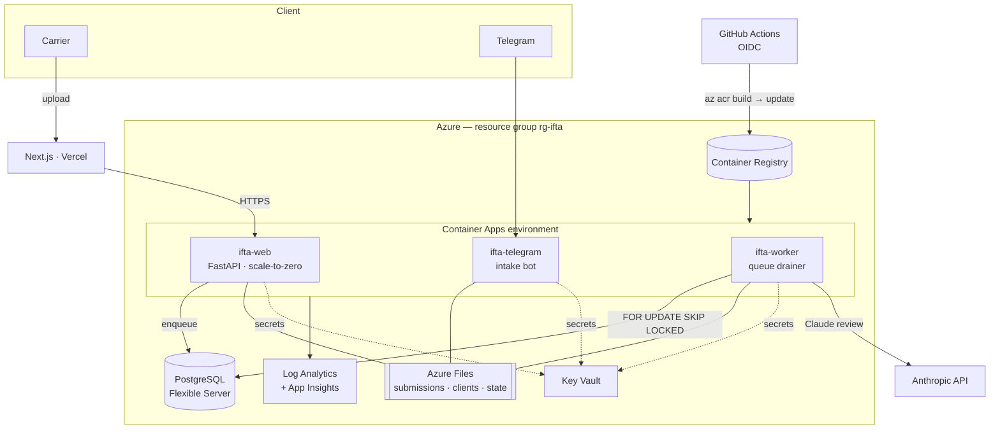

# IFTA on Azure — deployment runbook

Production runbook for landing the IFTA pipeline on Azure Container Apps with a
managed Postgres job store. Mirrors the single-host runbook in
[`deploy/README.md`](../deploy/README.md); the infrastructure itself is defined
in [`deploy/azure/main.bicep`](../deploy/azure/main.bicep).

**Safety model.** The Mac-mini deployment is left untouched — it runs on SQLite
and never sets `IFTA_WEB_DB_URL`. Azure sets that one variable and flips the
same code onto Postgres. Rollback is DNS + one env var (see
[Rollback](#rollback--migrate-back-to-the-mac-mini)). Teardown is one command
(see [Teardown](#teardown-stops-all-billing)).

## Architecture



## Prerequisites

- An Azure subscription (this is where the $1k credit applies), `az` CLI logged
  in (`az login`), and Bicep (`az bicep install`).
- **Owner**, or **Contributor + User Access Administrator**, on the subscription
  or resource group — the template creates role assignments.

---

## 1. Provision the infrastructure

```bash
az group create -n rg-ifta -l eastus

# Your AAD object id — lets the template seed secrets into the RBAC vault.
MY_OID="$(az ad signed-in-user show --query id -o tsv)"
# A strong Postgres admin password (upper+lower+digit+symbol, ≥12 chars).
PG_PW="$(openssl rand -base64 24)"

cp deploy/azure/main.parameters.example.json deploy/azure/main.parameters.json
# Edit main.parameters.json: set alertEmail, publicBaseUrl, corsOrigins, etc.
# (You can leave the 5 secret params as the sentinel — set real values in step 2.)

# Optional: lint + validate first
az bicep build -f deploy/azure/main.bicep
az deployment group validate -g rg-ifta -f deploy/azure/main.bicep \
  -p @deploy/azure/main.parameters.json \
  -p deployerPrincipalId="$MY_OID" pgAdminPassword="$PG_PW"

# Deploy
az deployment group create -g rg-ifta -f deploy/azure/main.bicep \
  -p @deploy/azure/main.parameters.json \
  -p deployerPrincipalId="$MY_OID" pgAdminPassword="$PG_PW"
```

Capture the outputs — you'll need them below:

```bash
az deployment group show -g rg-ifta -n main --query properties.outputs
# -> acrName, keyVaultName, webUrl, postgresFqdn, managedIdentityClientId, ...
```

> First deploy note: the container apps reference an image that doesn't exist in
> ACR yet, so their revisions are **unhealthy until step 4**. That's expected —
> the infra itself provisions cleanly.

---

## 2. Set the real secrets in Key Vault

The template seeded placeholder values. Set the real ones (the apps read them
on their next revision):

```bash
KV="$(az deployment group show -g rg-ifta -n main --query properties.outputs.keyVaultName.value -o tsv)"

az keyvault secret set --vault-name "$KV" -n anthropic-api-key    --value "sk-ant-..."
az keyvault secret set --vault-name "$KV" -n resend-api-key       --value "re_..."
az keyvault secret set --vault-name "$KV" -n turnstile-secret-key --value "0x4AAA..."
az keyvault secret set --vault-name "$KV" -n ifta-web-backend-key --value "$(openssl rand -hex 32)"
az keyvault secret set --vault-name "$KV" -n telegram-bot-token   --value "123456:ABC..."
```

`ifta-web-db-url` was already built from the Postgres FQDN + password — don't
overwrite it.

> **Note:** re-running `az deployment group create` reseeds these five secrets
> back to their placeholder, so re-run the `secret set` commands after any infra
> redeploy. The CI pipeline only builds images and calls `containerapp update`,
> so day-to-day deploys never touch your secrets.

---

## 3. Set up GitHub OIDC for CI

Lets [`.github/workflows/deploy-azure.yml`](../.github/workflows/deploy-azure.yml)
build and deploy with **no stored credentials**.

```bash
REPO="ArtJack/ifta-agent"            # owner/repo
RG_ID="$(az group show -n rg-ifta --query id -o tsv)"

APP_ID="$(az ad app create --display-name ifta-github-oidc --query appId -o tsv)"
az ad sp create --id "$APP_ID"

# Federated credential: trust GitHub Actions on main.
az ad app federated-credential create --id "$APP_ID" --parameters "{
  \"name\": \"github-main\",
  \"issuer\": \"https://token.actions.githubusercontent.com\",
  \"subject\": \"repo:${REPO}:ref:refs/heads/main\",
  \"audiences\": [\"api://AzureADTokenExchange\"]
}"

# Contributor on the resource group covers `az acr build` + `containerapp update`.
az role assignment create --assignee "$APP_ID" --role Contributor --scope "$RG_ID"
```

Then in the GitHub repo settings:

| Kind | Name | Value |
|---|---|---|
| Secret | `AZURE_CLIENT_ID` | `$APP_ID` |
| Secret | `AZURE_TENANT_ID` | `az account show --query tenantId -o tsv` |
| Secret | `AZURE_SUBSCRIPTION_ID` | `az account show --query id -o tsv` |
| Variable | `AZURE_RESOURCE_GROUP` | `rg-ifta` |
| Variable | `AZURE_ACR_NAME` | the `acrName` output from step 1 |
| Variable | `AZURE_APP_PREFIX` | `ifta` |

---

## 4. First image build + deploy

Trigger the workflow (Actions → **Deploy to Azure** → Run workflow), or do it
manually once:

```bash
ACR="$(az deployment group show -g rg-ifta -n main --query properties.outputs.acrName.value -o tsv)"
az acr build --registry "$ACR" --image ifta:bootstrap --image ifta:latest --file Dockerfile .

LOGIN="$(az acr show -n "$ACR" --query loginServer -o tsv)"
for app in ifta-web ifta-worker ifta-telegram; do
  az containerapp show -g rg-ifta -n "$app" >/dev/null 2>&1 \
    && az containerapp update -g rg-ifta -n "$app" --image "$LOGIN/ifta:latest"
done
```

The revisions should now go healthy.

---

## 5. Upload data to Azure Files

The agent grounds its review in **real client history** (`data/clients/<id>/`),
which is PII and lives only on the Mac mini. Copy it (and the Telegram
approvals) into the mounted shares:

```bash
ACCT="$(az storage account list -g rg-ifta --query "[0].name" -o tsv)"
KEY="$(az storage account keys list -g rg-ifta -n "$ACCT" --query "[0].value" -o tsv)"

# Real carrier history -> the 'clients' share (mounted at /app/data/clients)
az storage file upload-batch --account-name "$ACCT" --account-key "$KEY" \
  --destination clients --source data/clients

# Telegram approvals -> the 'state' share (IFTA_TELEGRAM_ACCESS_FILE)
az storage file upload --account-name "$ACCT" --account-key "$KEY" \
  --share-name state --source data/telegram_access.json --path telegram_access.json
```

---

## 6. DNS + frontend cutover

Point your API hostname at the web app and repoint the Next.js frontend.

```bash
WEB_FQDN="$(az containerapp show -g rg-ifta -n ifta-web \
  --query properties.configuration.ingress.fqdn -o tsv)"

# Bind the custom domain (add the CNAME + asuid TXT records it asks for at your DNS host)
az containerapp hostname add  -g rg-ifta -n ifta-web --hostname ifta-api.artjeck.com
az containerapp hostname bind -g rg-ifta -n ifta-web --hostname ifta-api.artjeck.com \
  --environment ifta-cae --validation-method CNAME
```

Then update the Vercel project: `NEXT_PUBLIC_IFTA_API_URL = https://ifta-api.artjeck.com`
(or the raw `$WEB_FQDN`) and redeploy. Turnstile + Resend config are unchanged.

---

## 7. Smoke test

```bash
curl -s "https://$WEB_FQDN/healthz"        # {"status":"ok"}
az containerapp logs show -g rg-ifta -n ifta-worker --follow   # watch a job drain
```

Then run the end-to-end submit flow from `artjeck.com/ifta/submit` exactly as in
[`deploy/README.md` step 6](../deploy/README.md).

---

## Job-state migration (SQLite → Postgres)

The `submissions` table is **transient queue state**, not filing history — the
carrier history the agent reads lives in `data/clients/` (uploaded in step 5).
So Azure simply **starts fresh** on Postgres. Before cutover, let any in-flight
jobs on the Mac mini finish (`sqlite3 data/web_jobs.db "SELECT status, COUNT(*)
FROM submissions GROUP BY status"` should show nothing QUEUED/RUNNING).

---

## Cost monitoring

A monthly Consumption **Budget + email alert** (80% actual / 100% forecast) is
provisioned by the template. Expected idle burn is ~$25–40/mo, so the $1k credit
lasts ~2 years. Spot-check anytime:

```bash
az consumption usage list --query "[].{name:instanceName, cost:pretaxCost}" -o table
```

---

## Teardown (stops all billing)

Everything lives in one resource group:

```bash
az group delete -n rg-ifta --yes --no-wait
```

Postgres and ACR are the only always-on costs, so this zeroes the burn. (Note:
the Key Vault has 7-day soft-delete; purge with `az keyvault purge` if you want
to reuse the exact name immediately.)

---

## Rollback / migrate back to the Mac mini

Because the Mac mini was never modified (SQLite, `IFTA_WEB_DB_URL` unset), it is
still a working deployment:

1. Repoint `ifta-api.artjeck.com` back to the Cloudflare Tunnel (Mac mini).
2. Set Vercel `NEXT_PUBLIC_IFTA_API_URL` back to the tunnel URL and redeploy.
3. The Mac mini is already serving — no rebuild needed.

Data created **on Azure since cutover** (new Postgres submissions, new files in
the `clients`/`state` shares) must be synced back if you want to keep it:
`az storage file download-batch` for the shares, and a `pg_dump`/CSV export of
the `submissions` table.

---

## Troubleshooting

| Symptom | Cause / fix |
|---|---|
| Deploy fails writing a KV secret | You lack **Key Vault Secrets Officer** on the vault — pass `deployerPrincipalId=$MY_OID`. |
| App revision unhealthy, `ImagePullFailure` | No image in ACR yet (do step 4), or the app identity lacks **AcrPull** (re-check the role assignment in the template). |
| App can't read a secret | The user-assigned identity lacks **Key Vault Secrets User**, or the secret name/URL is wrong. |
| Worker never processes jobs | Confirm `IFTA_WEB_DB_URL` is set on the app and Postgres firewall rule `AllowAzureServices` exists; DSN must end with `?sslmode=require`. |
| Telegram approvals reset after restart | `IFTA_TELEGRAM_ACCESS_FILE` not set or the `state` share not mounted. |
| `az acr build` permission denied in CI | The OIDC app needs **Contributor** on the RG (step 3). |
