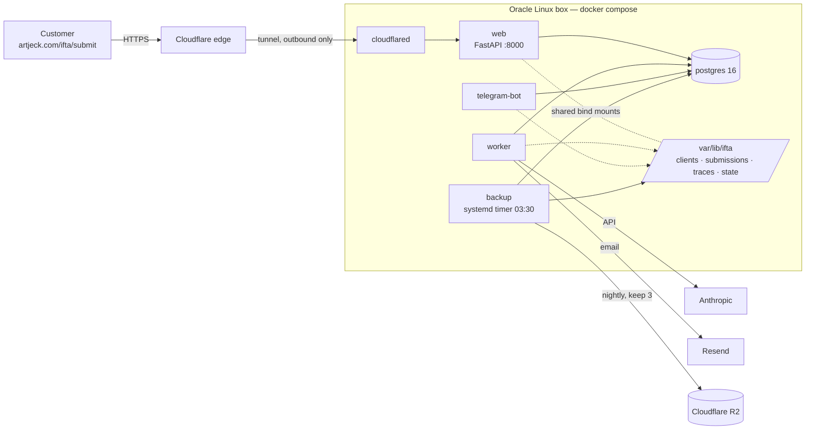

# IFTA on the Oracle Cloud box — deployment runbook

The permanent home for the IFTA pipeline: one **Oracle Cloud** VM
(`artjeck-oracle`, an always-free `VM.Standard.A1.Flex` running **Ubuntu
24.04**) hosting the whole stack under Docker Compose, reached through a
Cloudflare Tunnel, with nightly snapshots replicated to Cloudflare R2.

> **Oracle Cloud, not Oracle Linux.** The provider and the distro are different
> things, and conflating them is not cosmetic: this runbook and `install.sh`
> used to prescribe `dnf`, SELinux labelling and `firewalld`, none of which
> exist on the box. The installer could only ever succeed where Docker was
> already present. It now handles both families; the notes below say which
> parts apply here.

This replaced the Azure Container Apps deployment and the Mac mini launchd
deployment. Both are gone — Azure was torn down in August 2026 (its runbook is
kept as history in [archive/AZURE.md](archive/AZURE.md)) and the Mac's launchd
agents are retired. **Neither is a fallback**; see **Rollback** below.

> **Real customer PII.** `data/clients/`, `data/web_submissions/` and the
> backup archives contain real carrier data. Keep the box's disk encrypted,
> keep the R2 bucket private, and keep `deploy/oracle/.env` at mode 0600.

---

## Architecture



**No inbound ports.** `cloudflared` dials *out* to Cloudflare, so the OCI
security list / firewalld needs no open ports at all. This is the single
biggest reason to prefer the tunnel over a public IP plus Caddy.

| Piece | Choice | Why |
|---|---|---|
| Orchestration | Docker Compose + systemd | One box; systemd owns start/stop, Docker owns per-container restarts |
| Job state | Postgres 16 container | Reuses the `db_postgres` backend already built and tested for Azure |
| PII storage | Bind mounts under `/var/lib/ifta` | Inspectable and migratable from the host; `:Z` labels satisfy SELinux |
| Rate cache | Named volume `ifta-rates` | Docker seeds a named volume from the image; a bind mount would hide the committed cache |
| Ingress | Cloudflare Tunnel | No open ports, TLS at the edge, reuses the existing domain |
| Backups | Nightly tar.gz → R2, keep 3 | Off-box copy; each run deletes the oldest beyond 3 |

---

## Prerequisites

- Ubuntu 24.04 (or an RHEL-family host), root/sudo, outbound internet (no inbound needed).
- The repo cloned on the box, e.g. `/opt/ifta-agent`.
- A Cloudflare account holding `artjeck.com` (already the case).
- Keys in hand: Anthropic, Resend, Turnstile secret, Telegram bot token.

```bash
sudo apt-get -y install git      # dnf on RHEL-family hosts
sudo install -d -o "$USER" -g "$USER" /opt/ifta-agent
git clone git@github.com:ArtJack/ifta-agent /opt/ifta-agent
```

Two things about that clone worth knowing before it fails on you:

* **The repo is private**, so anonymous HTTPS will not work. The box needs an
  SSH key that GitHub accepts — either an account key or a deploy key on this
  repo.
* **Clone as the deploy user, not as root.** Git authentication is per-user: a
  `sudo git clone` looks in `/root/.ssh`, finds no key, and fails with
  `Host key verification failed` — an error that names the host key and so
  reads as a network or `known_hosts` problem rather than the permissions one
  it actually is. The checkout must stay owned by that same user, because
  `update.sh` pulls as whoever owns it.

Everything below assumes `PROJECT=/opt/ifta-agent`.

---

## 1. Cloudflare Tunnel

**What production actually does** (this differs from what an earlier draft of
this runbook prescribed — the compose file is the authority, see the comment
above the `cloudflared` service): the existing **locally-managed** `ifta-api`
tunnel was *relocated* from the Mac mini rather than a new one being created.
Same tunnel UUID, so the `ifta-api.artjeck.com` CNAME was never touched and
there was no DNS cutover.

- Ingress lives on the box at `/etc/cloudflared/config.yml`, not in the
  dashboard, and maps `ifta-api.artjeck.com` → `http://web:8000` (`web` is the
  compose service name; cloudflared resolves it on the compose network, which is
  why no port is published to the host).
- The service runs only under the `tunnel` compose profile. Enable it by setting
  `COMPOSE_PROFILES=tunnel` in `deploy/oracle/.env`, which the systemd unit
  passes through. `CLOUDFLARE_TUNNEL_TOKEN` in `.env.example` is vestigial — no
  compose service reads it.

For a **new** host, either move the tunnel the same way (copy
`/etc/cloudflared/` and its credentials file) or create a remotely-managed
tunnel in Zero Trust → Networks → Tunnels and point its Public Hostname at
`http://web:8000`.

---

## 2. Cloudflare R2 bucket

1. Cloudflare dashboard → **R2** → **Create bucket** → `ifta-backups`.
   Location hint: closest to the box. **Do not** attach a public domain or
   enable public access — these archives are unencrypted PII.
2. **Manage API tokens** → **Create API token**:
   - Permission **Object Read & Write**
   - Scope it to the `ifta-backups` bucket only
3. Save the **Access Key ID**, **Secret Access Key**, and the
   **S3 endpoint** (`https://<ACCOUNT_ID>.r2.cloudflarestorage.com`).

Free tier is 10 GB-month of storage with no egress fees. Three snapshots of the
current dataset are far under that — check yours with `du -sh data/` before
cutover, and see [If the data outgrows R2](#if-the-data-outgrows-r2) if it is
ever close.

---

## 3. Configure secrets

```bash
cd /opt/ifta-agent
sudo install -m 600 deploy/oracle/.env.example deploy/oracle/.env
sudo openssl rand -base64 32     # -> POSTGRES_PASSWORD
sudo openssl rand -hex 32        # -> IFTA_WEB_BACKEND_KEY
sudo $EDITOR deploy/oracle/.env
```

Fill in every `REPLACE*` value. `deploy/oracle/.env.example` documents each
one. The install script refuses to proceed while `POSTGRES_PASSWORD`,
`ANTHROPIC_API_KEY`, or `RESEND_API_KEY` is still a
placeholder.

Leave `TELEGRAM_BOT_TOKEN` empty for now — the bot only starts under the
`telegram` profile (step 7).

---

## 4. Install

```bash
sudo bash deploy/oracle/install.sh
```

It installs Docker CE and the compose plugin (Oracle Linux ships podman;
the unit files drive `docker compose`), creates `/var/lib/ifta/{clients,
web_submissions,traces,state,postgres}` owned by uid 10001, registers an
SELinux `container_file_t` context for that tree, installs the systemd units,
then builds the image and starts the stack.

First build takes several minutes. Watch it:

```bash
journalctl -u ifta -f
```

Verify:

```bash
cd /opt/ifta-agent/deploy/oracle
sudo docker compose ps                                   # all Up / healthy
sudo docker compose exec web curl -fsS localhost:8000/healthz   # -> ok
sudo bash install.sh doctor                              # full diagnostic
```

---

## 5. Migrate the data — done

The Mac-mini data move and the DNS cutover happened on 2026-08-14 and are not
repeatable steps. Two facts from them are worth keeping:

- Customer PII (`clients/`, `web_submissions/`, `traces/`, `state/`) lives under
  `$IFTA_STATE_DIR` (`/var/lib/ifta`) and must be owned by uid **10001** — the
  container's unprivileged `ifta` user — or every write fails.
- There was **no DNS change**: the same tunnel UUID moved hosts, so the
  `ifta-api.artjeck.com` CNAME still points where it always did.

To seed a *new* box, restore a snapshot instead — see **Restore drill** below.

---

## 7. Enable the Telegram bot

Once the real token is in `.env`:

```bash
cd /opt/ifta-agent/deploy/oracle
sudo docker compose --profile telegram up -d
sudo docker compose logs -f telegram-bot
```

Only one poller may hold the bot token — two fight over updates and
each sees a random half of the messages.

To make it start on boot with everything else, add `--profile telegram` to the
`ExecStart` line in `/etc/systemd/system/ifta.service`, then
`sudo systemctl daemon-reload`.

---

## Backups

`ifta-backup.timer` fires nightly at **03:30** local (plus up to 5 min jitter)
and runs `ifta backup` in a one-shot container. Each run:

1. Copies `data/` (clients, submissions, traces, state) into a staging dir.
2. `pg_dump --format=custom` of the job database → `data/web_jobs.dump` in the
   same archive. This matters: job state is in Postgres, not under `data/`, so
   a file-only archive would restore with zero submissions.
3. Writes `ifta-data-<UTC timestamp>.tar.gz` to `/var/lib/ifta/backups`.
4. Uploads it to `r2://ifta-backups/snapshots/`.
5. **Prunes both sides to the newest `IFTA_BACKUP_KEEP` (default 3)** — the
   fourth-oldest is deleted as each new one lands, so neither the disk nor the
   bucket grows without bound.

```bash
sudo systemctl start ifta-backup            # run one now
journalctl -u ifta-backup -n 30             # what it did
systemctl list-timers ifta-backup           # when it next fires

cd /opt/ifta-agent/deploy/oracle
sudo docker compose --profile backup run --rm backup ifta backup-list            # local
sudo docker compose --profile backup run --rm backup ifta backup-list --remote   # in R2
```

`Persistent=true` on the timer means a snapshot missed while the box was off
runs at next boot instead of leaving a silent gap.

If R2 is only *partially* configured, the backup **fails loudly** rather than
quietly keeping snapshots on the box — a backup you believe is offsite but
isn't is the worst of both worlds.

### Restore drill

Do this once now, so you have done it before you need it.

```bash
cd /opt/ifta-agent/deploy/oracle
S=backup   # the one-shot service

# 1. Fetch the newest archive out of R2
sudo docker compose --profile backup run --rm $S ifta backup-fetch

# 2. Extract to a staging dir — never over the live data
sudo docker compose --profile backup run --rm $S \
    ifta backup-restore --snapshot /backups/ifta-data-<ts>.tar.gz --into /backups/verify

# 3. Eyeball it
sudo ls /var/lib/ifta/backups/verify/data/clients

# 4. Files: stop, swap, start
sudo systemctl stop ifta
sudo mv /var/lib/ifta/clients /var/lib/ifta/clients.bak
sudo mv /var/lib/ifta/backups/verify/data/clients /var/lib/ifta/clients
sudo chown -R 10001:10001 /var/lib/ifta/clients && sudo restorecon -R /var/lib/ifta
sudo systemctl start ifta

# 5. Database, if you also need the job rows back
sudo docker compose cp /var/lib/ifta/backups/verify/data/web_jobs.dump postgres:/tmp/j.dump
sudo docker compose exec postgres pg_restore -U ifta -d ifta --clean --if-exists /tmp/j.dump
```

The file swap and the database load are deliberately separate steps so each is
independently verifiable.

### If the data outgrows R2

Three snapshots must fit in R2's 10 GB free tier. Check headroom:

```bash
sudo du -sh /var/lib/ifta/backups /var/lib/ifta/web_submissions
```

`web_submissions` is what grows — every customer upload plus generated packet.
Two options when it gets close:

- **Prune old submissions.** They are reproducible from `data/clients/` history
  and already delivered by email; archiving anything older than a year keeps
  the snapshot small.
- **Pull to the Alienware 2 TB SSD instead.** The box cannot push to your home
  LAN, so run this *from* the Alienware on a schedule (Task Scheduler / cron),
  using the same R2 credentials or `rsync` over SSH:

  ```bash
  rclone sync r2:ifta-backups/snapshots /mnt/ssd/ifta-backups --max-age 30d
  ```

  Then set `IFTA_BACKUP_KEEP=2` on the box to shrink the cloud footprint.

---

## Day-to-day operations

```bash
# Deploy new code (takes a pre-deploy snapshot first, then rebuilds and rolls)
sudo bash /opt/ifta-agent/deploy/oracle/update.sh

# Status / logs
systemctl status ifta
journalctl -u ifta -f
cd /opt/ifta-agent/deploy/oracle && sudo docker compose logs -f web worker

# Restart one service
sudo docker compose restart worker

# Full stop / start
sudo systemctl stop ifta
sudo systemctl start ifta

# Diagnose
sudo bash /opt/ifta-agent/deploy/oracle/install.sh doctor
```

`update.sh` refuses to deploy if the pre-deploy snapshot fails — the moment you
need a backup from *before* a deploy is exactly the moment you would regret
skipping it.

---

## Rollback

There is no other host to fall back to: the Mac mini deployment is retired and
the Azure one is torn down. Rollback means going backwards on **this** box.

**A bad deploy** — tag the running image before you build, because `update.sh`
prunes dangling images at the end:

```bash
sudo docker tag ifta:latest ifta:pre-$(date +%F)      # BEFORE update.sh
# then, to go back:
sudo docker tag ifta:pre-<date> ifta:latest
cd /opt/ifta-agent/deploy/oracle && sudo docker compose up -d --no-build
```

Code: `git -C /opt/ifta-agent reset --hard <previous-sha>` (tag it first too).

**Bad data** — stop the stack, restore the pre-deploy snapshot per the restore
drill above, `chown -R 10001:10001`, start again. `update.sh` always takes a
snapshot before it deploys, and refuses to continue if that fails.

---

## Troubleshooting

**`EACCES` / permission denied writing to `/app/data/...`.** SELinux. The bind

On this box (Ubuntu/AppArmor) the compose `:Z` labels are **no-ops** — access
works because `install.sh` chowns the state directories to uid 10001. If a
container cannot write, check ownership first:
`sudo ls -ln /var/lib/ifta` should show `10001 10001`. The SELinux advice below
applies only to an RHEL-family host, where `getenforce` exists (Enforcing is
fine — do not disable it; relabel with `restorecon -R /var/lib/ifta`).

**`pg_dump: server version mismatch`.** `pg_dump` must be at least the server's
version. The image pins `postgresql-client-16` and compose pins
`postgres:16-alpine`; if you bump one, bump the `PG_MAJOR` build arg to match.

**Backup fails with `partially configured`.** Some but not all of the four
`IFTA_BACKUP_R2_*` variables are set. Set all four or none.

**R2 upload fails with a checksum or `NotImplemented` error.** Newer boto3 adds
integrity checksums by default. `build_client` already requests them only
`when_required`; if you pinned an unusual boto3, that is the knob.

**`docker: command not found` but podman works.** Oracle Linux ships podman;
the unit files drive `docker compose`. Re-run `install.sh`, which adds Docker's
repo. (Podman would work with `podman-compose`, but the systemd units and the
`:Z` handling here assume Docker.)

**Every customer shares one rate-limit bucket.** `FORWARDED_ALLOW_IPS=*` must
be set (it is, in the compose env) — cloudflared is not loopback, so without it
uvicorn ignores `X-Forwarded-For` and sees one client IP for everyone.

**`/submit` returns 503 "CAPTCHA not configured".** That is the fail-closed
guard doing its job: `IFTA_WEB_REQUIRE_TURNSTILE=1` (the compose default) makes
a missing `TURNSTILE_SECRET_KEY` reject anonymous submissions rather than
silently accepting them. Set the real Turnstile secret. Do **not** turn the
guard off to make the error go away — without it the endpoint is open to
anyone, and every submission spends model tokens and sends mail from your
domain.

**A submission sits in QUEUED for a minute after an error.** Expected. A
transient failure (iftach.org blip, model API hiccup, Postgres failover) is
retried with a back-off — 60s, then 120s — before the customer is told
anything. `next_attempt_at` on the row holds the deadline; `attempts` counts
claims and stops at 3. Previously all three retries fired within a few
milliseconds, so the customer got a failure email for outages that would have
cleared on their own.

**Tunnel is up but `/healthz` 502s.** The Public Hostname service must be
`http://web:8000` — the compose service name, not `localhost:8000`. cloudflared
runs in its own container.

**Telegram bot answers twice, or misses messages.** Two pollers on one token.
Make sure only one bot process holds the token (the compose `telegram-bot` service).
