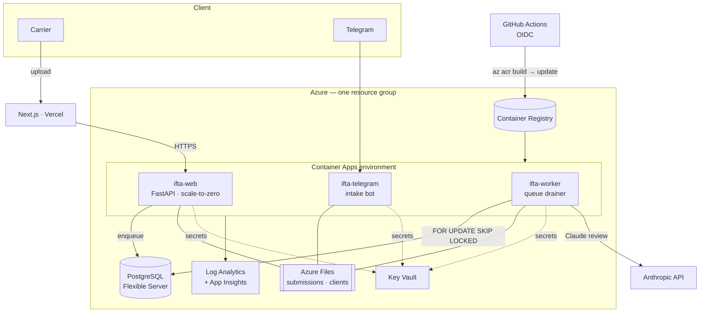

# Case Study — an AI agent that files quarterly fuel taxes for trucking fleets

**Live:** [artjeck.com/ifta](https://artjeck.com/ifta) · **API:** `ifta-api.artjeck.com` ·
**Status:** in production, serving a real carrier (DM Express) every quarter.

> One line: *Carriers drop in their messy mileage + fuel-card exports; minutes later they
> get a filing-ready IFTA packet that an LLM agent has reviewed against the regulations and
> their own filing history.*

---

## The problem (why anyone pays for this)

Every trucking company that crosses state lines must file an **IFTA** return each quarter —
miles driven and fuel purchased, apportioned across every U.S. state and Canadian province,
at tax rates that change quarterly. It's error-prone, deadline-driven, and a state audit on
a wrong number is expensive. Today it's done by hand in spreadsheets or paid out to a bookkeeper.

## What I built

A two-layer system, deliberately split:

1. **A deterministic pipeline** (`ingest → calc → validate → report`) that does all the
   *math* — parses CSV/Excel/PDF exports, computes fleet MPG, taxable gallons, and per-
   jurisdiction tax/surcharge, and writes the gov-portal CSV + a review Excel.
2. **An LLM review agent** (Anthropic SDK, **16 tools**) that does the *judgment* — it can
   query the computed return, the rule base, the live rate matrix, and **21 quarters of real
   filing history across two carriers**, and writes a pre-filing review note flagging anything
   that looks off before a human submits.

Plus the parts that make it a real service, not a script: a **multi-tenant web intake**
(Next.js form on the brand site → proxied to a FastAPI backend), a **Telegram operator-
approval gate**, magic-link "send more files" flows, email delivery, CAPTCHA, and rate limiting.

## Architecture

```
 customer ──upload──▶ artjeck.com/ifta  (Next.js 16 on Vercel)
                            │  server-side proxy (X-Backend-Key, hides the backend)
                            ▼
              ifta-api.artjeck.com  (FastAPI, Cloudflare Tunnel → Mac mini)
                            │
        ┌───────────────────┼─────────────────────────┐
        ▼                   ▼                         ▼
  deterministic        review agent              operator gate
  pipeline             (Claude + 16 tools)       (Telegram approve/reject)
  ingest/calc/         grounded in returns,      → packet emailed (Resend)
  validate/report      rules, rates, history
```

No cloud GPU bill: the backend runs on a Mac mini behind a Cloudflare Tunnel; the frontend
is on Vercel. The only variable cost is the model spend per review.

## The engineering decisions I'd want to talk about in an interview

- **Math is deterministic; the LLM only reviews.** The agent never *computes* the tax — it
  checks work that Python already did. That's the difference between a tool a carrier can
  trust for a government filing and a demo. The agent is grounded by 16 tools so it cites real
  numbers instead of inventing them.
- **Regression tested to the penny.** Tests assert that fleet MPG, miles, and total tax due
  match known-correct historical filings exactly — so a refactor can't silently change a
  number that goes on a tax form.
- **Cost control by risk tier.** Routine reviews run on Haiku/Sonnet; only the highest-risk
  ones escalate to Opus, with a `--effort` knob for thinking depth. Cheap by default,
  thorough when it matters.
- **Real-world safety, not toy auth.** Multi-tenant isolation per client, an operator
  approval step before any customer file is processed, magic-link tokens as auth, Turnstile
  CAPTCHA, per-IP rate limiting, and atomic "all files land or none do" submission writes.
- **Pragmatic deployment.** Mac mini + Cloudflare Tunnel (no public IP, no server bill) +
  Vercel front end — the cheapest path to a real, always-on production service.

## The evaluation harness — the part I'd want to be judged on

A senior agent engineer is measured less by the demo than by *how they know it works*. So the
review agent and the vision extractor are wrapped in a layered eval stack — every layer graded
against human-checked gold, and only the mechanical layers allowed to block a filing.

| Layer | What it grades | Role |
|---|---|---|
| **Heuristics + prompt** | domain knowledge distilled from a labeler's reading notes | input |
| **Benchmark** | tax-safe rate, per-field accuracy, regression deltas vs history | **gate** — CLI exits non-zero |
| **Tracing** | the agent's actual run — tools, turns, tokens | observability |
| **Span / trajectory eval** | right tools, right order, within budget | regression guardrail |
| **Rubric + validated LLM judge** | note *quality* — coverage, grounding, clarity, alignment | advisory |

Three things this stack caught that a demo never would:

1. **The gate stopped a regression I was about to ship.** I distilled 36 of the labeler's
   receipt annotations into the extraction prompt — a well-meaning, expertise-driven change.
   The benchmark measured it: `card_last4` accuracy fell **91% → 62%** and a tax-critical field
   slipped. I shipped only the v2 that kept the one *proven* win — a multi-receipt-photo guard
   that drops the model's confidence **0.97 → 0.40** so a human reviews it — and reverted the
   rest. Tax-critical back to **100%**, no regressions. Decisions from data, not vibes.

2. **The harness QA'd its own gold.** A raw run read 96% tax-safe with two "dangerous" errors.
   Adjudicating each against the actual receipt photo, the model was right *both* times — one
   was a human year-typo in the label (`2025` vs the receipt's `2023`), the other a
   two-receipts-in-one-photo the labeler had left blank. Corrected gold → **100% on
   date/state/gallons, zero dangerous errors across 47 receipts.** The eval's first job turned
   out to be validating the labels, not the model.

3. **I refused to gate on an unvalidated judge.** The LLM-as-judge scores note quality — but an
   LLM judge is only worth its *agreement with a human*, so it ships with an `agreement()`
   function that compares judge scores to human gold **per criterion** before you trust it. The
   judge **informs**, the deterministic status **decides** whether to file, the benchmark
   **gates** the pipeline. Three jobs, kept separate — a model never grades its own filing call.

The dataset is 47 real receipts, hand-labeled blind by a domain expert, tagged by difficulty.
Receipts, labels, predictions, and traces are customer PII — git-ignored, never committed; the
write-ups carry methodology and aggregate numbers only.

## Results

- **In production** with a real recurring client (DM Express), filing quarter over quarter.
- Replaces a manual, **error-prone** spreadsheet process — hand-keyed per-truck miles and fuel,
  prone to formula and rounding mistakes — with an automated packet returned in **minutes,
  reviewed**.
- Penny-accurate against historical filings (regression-tested).
- Model cost per reviewed filing: **~$0.10** (real runs ranged $0.08–$0.13, by model + effort).

## Scales to large fleets

The review is bounded by **findings, not fleet size** — the agent reviews the aggregate
return plus the exception trucks (outliers, missing data, MPG anomalies), not one write-up
per truck. Measured at production settings:

| Fleet | Review time | Output | Cost | Findings |
|---|--:|--:|--:|--:|
| 1 truck (real) | ~2.4 min | 7.4k tok | ~$0.15 | — |
| 5–6 trucks (real — DM Express) | ~2.0 min | 6.5k tok | ~$0.19 | 15 |
| **100 trucks (synthetic load test)** | **~1.8 min** | 5.4k tok | ~$0.22 | 16 |

A 100-truck fleet reviewed *faster* than five — because trucks don't drive the cost, the
**number of anomalies does**, and the per-state return caps at ~48 jurisdictions regardless
of fleet size. The deterministic per-truck Excel still covers every truck; the AI spends its
attention on the material exceptions, like a good auditor. Reproducible via
`scripts/load_test_fleet.py`.

> Measuring this also flushed out a real bug: a multi-truck review's *thinking + JSON* had
> been overflowing the token budget and silently truncating to a deterministic-only packet —
> caught by **measuring at scale, not guessing**, and fixed before it ever hit a real fleet.

## ☁️ Production infrastructure on Azure

The pipeline runs as a containerised, **infrastructure-as-code** deployment on Azure —
the same code the Mac mini runs, flipped onto managed cloud services by a single
environment variable, with the local deployment kept as a warm fallback.



The engineering choices worth talking about:

- **One image, three roles** on **Azure Container Apps** — `web` (HTTPS ingress, scale-to-zero),
  `worker` (a poller), and the `telegram` bot — each the same container with a different command.
- **Pluggable persistence.** The job store is a facade: SQLite on the single host, **Azure
  Database for PostgreSQL** in the cloud, chosen at runtime by one env var. The Postgres queue
  claim uses `SELECT … FOR UPDATE SKIP LOCKED` for safe concurrent draining. All 429 tests keep
  running on SQLite unchanged.
- **Secrets never touch the image or env files** — they live in **Key Vault** and are read by a
  **user-assigned managed identity** that also pulls the image from **Container Registry** (no
  admin creds, no stored passwords).
- **CI/CD with zero stored credentials** — **GitHub Actions via OIDC** federated identity builds
  the image with ACR Tasks and rolls the revisions.
- **Cost-governed by design** for a temporary credit: scale-to-zero web tier, a Burstable DB, and
  a **Consumption Budget + alert** — ~$25–40/mo idle, and teardown is a single `az group delete`.
- **All of it is code** — [`deploy/azure/main.bicep`](../deploy/azure/main.bicep) provisions the
  whole stack; the full runbook (provision → secrets → cutover → teardown/rollback) is in
  [`docs/AZURE.md`](../docs/AZURE.md).

## What's next

Hosted vector DB for the rule base; surfacing the **benchmark history publicly** as a live eval
dashboard (the golden-filings → pass-rate gate already runs locally and blocks regressions);
expanding the gold receipt set; and onboarding a second and third carrier.

## Stack

Python 3.12, Anthropic SDK, FastAPI, pandas, pdfplumber/openpyxl · Next.js 16 + TypeScript +
Vercel · Cloudflare Tunnel + Turnstile, Resend, python-telegram-bot · pytest, ruff, mypy(strict).

**Cloud (Azure):** Container Apps · Database for PostgreSQL (Flexible Server) · Azure Files ·
Key Vault + managed identity · Container Registry · Log Analytics/Application Insights ·
Bicep (IaC) · GitHub Actions (OIDC) · Consumption Budgets.

---

## Résumé bullets (drop into your CV / LinkedIn)

- Built and **shipped to production** an AI agent that automates quarterly IFTA fuel-tax
  filing for trucking fleets — deterministic Python pipeline + a 16-tool Claude review agent —
  now serving a recurring real-world client.
- Engineered the system so the LLM **reviews** rather than computes, grounding every answer in
  real returns/rules/rate data; **regression-tested tax math to the penny** against historical
  filings.
- Built a layered **evaluation harness** — gated benchmark with regression detection, agent
  tracing, tool-trajectory grading, and a human-validated LLM judge — that **caught a real
  prompt regression** (a field fell 91%→62%) before it reached the tax path and QA'd the gold
  labels themselves to a verified **100% on tax-critical fields** across 47 hand-labeled receipts.
- Designed a multi-tenant FastAPI + Next.js service with operator approval, magic-link auth,
  CAPTCHA, and rate limiting; deployed on a Mac mini via Cloudflare Tunnel + Vercel for ~$0
  infra.
- **Containerised and deployed the service to Azure as infrastructure-as-code** — Container Apps
  (web/worker/bot), managed PostgreSQL, Key Vault + managed identity, and a **credential-less
  GitHub Actions OIDC pipeline** defined in Bicep — behind a runtime backend switch that keeps
  SQLite and all 429 tests green, with a Consumption Budget guardrail for cost control.
- Cut quarterly filing prep from hours of manual spreadsheet work to **minutes**, with
  risk-tiered model selection (Haiku/Sonnet/Opus) for cost control.

---

## 90-second Loom script (record this — your notes say it matters)

1. **(0:00–0:10) Hook.** "Every trucking company has to file IFTA fuel taxes every quarter —
   it's miserable. I built an AI agent that does it. It's live and a real carrier uses it."
2. **(0:10–0:35) Show the product.** Open `artjeck.com/ifta`, upload a sample mileage + fuel
   file on `/ifta/submit`. Talk over the wait: "files go to a Next.js proxy, then my FastAPI
   backend on a Mac mini behind a Cloudflare Tunnel."
3. **(0:35–1:05) Show the smart part.** Open the review note / Excel packet. "The math is
   deterministic Python — the LLM never computes the tax, it *reviews* it, grounded in 16
   tools over the return, the rules, live rates, and 21 quarters of history. Here it flagged
   [X]."
4. **(1:05–1:25) Show the rigor.** Flash the eval harness — "the benchmark gate caught a
   prompt regression, a field dropping 91% to 62%, before it could ship to a tax form" — plus
   the penny-accurate regression test and the Telegram operator-approval gate.
5. **(1:25–1:30) Close.** "Real product, real client, in production. Code and write-up linked
   below." (Link this case study + repo.)
